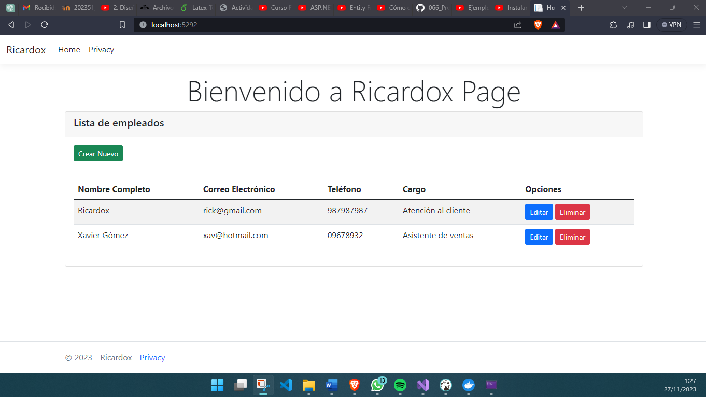
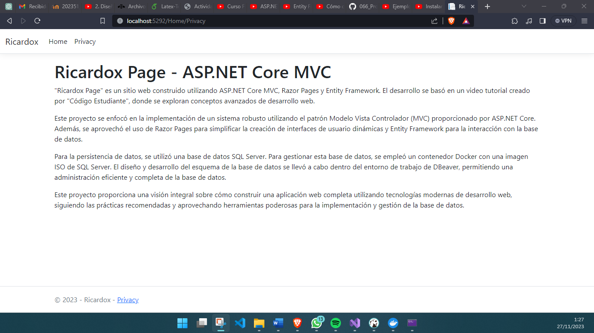
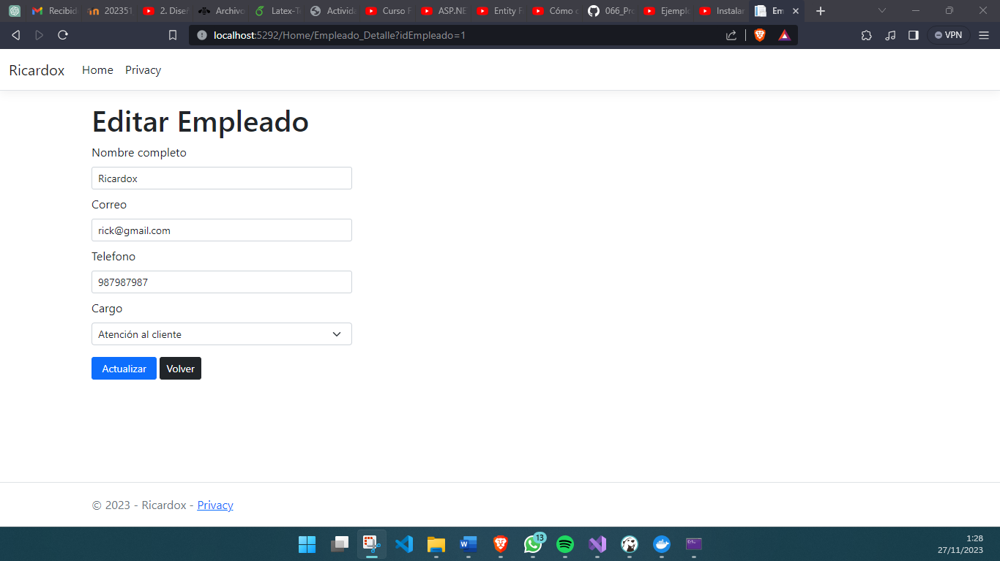
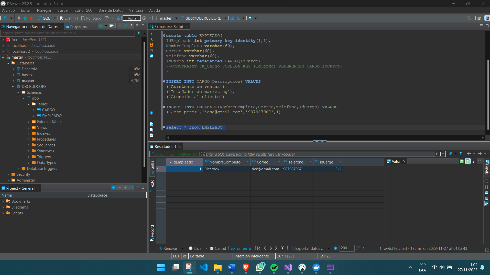

# Proyecto "Ricardox Page" - ASP.NET Core MVC

Este proyecto, denominado "Ricardox Page", está desarrollado con ASP.NET Core y se centra en el uso de tecnologías clave como Razor Pages, Entity Framework Core y el patrón Modelo Vista Controlador (MVC). El objetivo principal es crear un sitio web dinámico y completo con funcionalidades CRUD (Crear, Leer, Actualizar, Eliminar) y una integración efectiva con una base de datos SQL Server.

## Descripción

El proyecto "Ricardox Page" se basa en la implementación de un sistema web interactivo y dinámico que aprovecha las siguientes tecnologías y metodologías:

- **ASP.NET Core:** Framework de desarrollo web de alto rendimiento y multiplataforma que ofrece una arquitectura flexible para la creación de aplicaciones web modernas.

- **Razor Pages:** Utilización de Razor Pages para la construcción de páginas web dinámicas con sintaxis sencilla que combina HTML y código C# para una interacción fluida con el servidor.

- **Entity Framework Core:** Utilización de Entity Framework Core para mapear objetos a tablas de base de datos y realizar operaciones CRUD de manera eficiente y segura.

- **Patrón Modelo Vista Controlador (MVC):** Implementación del patrón MVC para separar la lógica de negocios, la presentación y la manipulación de datos, lo que facilita la mantenibilidad y escalabilidad del proyecto.

## Características Principales

- **Gestión de Datos:** Integración de Entity Framework Core para realizar operaciones de lectura, escritura, actualización y eliminación de datos en una base de datos SQL Server.

- **Interfaz de Usuario Dinámica:** Uso de Razor Pages para construir interfaces de usuario interactivas, permitiendo la presentación de datos de forma dinámica y efectiva.

- **Enrutamiento y Control de Peticiones:** Implementación de enrutamiento para dirigir las peticiones HTTP a controladores específicos según las rutas definidas.

- **Mantenibilidad y Escalabilidad:** Aplicación del patrón MVC para estructurar el código de manera organizada y modular, facilitando el mantenimiento y la escalabilidad del proyecto.

## Instrucciones de Uso

1. **Clonar el Repositorio:** Clona este repositorio en tu máquina local utilizando el comando `git clone`.

2. **Configuración del Entorno:** Asegúrate de tener instalado .NET Core SDK y SQL Server para ejecutar y gestionar la base de datos.

3. **Ejecución del Proyecto:** Utiliza Visual Studio o Visual Studio Code para abrir el proyecto, en específico el archivo `CRUDCORE.sln`.

4. **Conexión Base de Datos:** Dentro de SQL Server, crea una base de Datos, denominada `DBCRUDCORE`dentro de esta ingresa: 

```sql
use DBCRUDCORE;

CREATE TABLE CARGO(
    IdCargo int primary key identity(1,1),
    Descripcion varchar(50)
)

create table EMPLEADO(
    IdEmpleado int primary key identity(1,1),
    NombreCompleto varchar(60),
    Correo varchar(60),
    Telefono varchar(60),
    IdCargo int references CARGO(IdCargo)
    --CONSTRAINT FK_Cargo FOREIGN KEY (IdCargo) REFERENCES CARGO(IdCargo)
)
```
5. **Vuelve a tu Compilador Visual Studio:** Cambia el archivo `appsettings.json` en específico la tercera línea por tu UserId y tu Contraseña.

6. **Consola de Administración de Paquetes NuGet:** Si estás en Visual Studio, dirigete a la sección de arriba, busca el Fichero "Herramientas" dale clic, se desplegará algunas opciones, selecciona "Administrador de Paquetes NuGet", se desplegará más opciones, selecciona "Consola de Administración de Paquetes"

7. **Comando en la Terminal:** Una vez se abrá una terminal en la sección de abajo, coloca lo siguiente:
   ```sql
   Scaffold-DbContext "Data Source=(local);Initial Catalog=DBCRUDCORE;user id=sa;pwd=claveSQL4" Microsoft.EntityFrameworkCore.SqlServer -OutputDir Models -Force` recuerda cambiar por tu *user id* y tu *pwd*, dale ENTER
   ```
9. **Corre el programa:** Con la terminal mostrando que no hubo errores, corre el programa, se abrirá una consola, no debes de cerrarla, al mismo tiempo se abrirá una ventana con dirección de Localhost, en ella podrás ver el contenido, además de poder ya interactuar con la página.

## Evidencia de Funcionamiento de la Página

### Vista General de la Página
<br>

### Vista Privacy de la Página
<br>

### Vista Editar del Dato
<br>

### Uso de DBeaver para correr la Base SQL Server
<br>

### Uso de Docker para ejecutar el puerto e imagen ISO de SQL Server
<br>

## Autor

- Ricardo Rivadeneira
